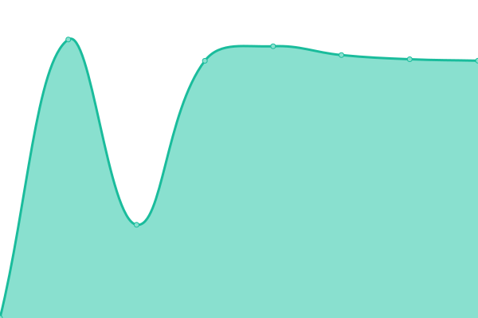

# [📈 Live Status](https://status.fieldcontrol.com.br): <!--live status--> **🟧 Partial outage**

This repository contains the open-source uptime monitor and status page for [Field Control](https://fieldcontrol.com.br), powered by [Upptime](https://github.com/upptime/upptime).

With [Upptime](https://upptime.js.org), you can get your own unlimited and free uptime monitor and status page, powered entirely by a GitHub repository. We use [Issues](https://github.com/FieldControl/status/issues) as incident reports, [Actions](https://github.com/FieldControl/status/actions) as uptime monitors, and [Pages](https://status.fieldcontrol.com.br) for the status page.

<!--start: status pages-->
<!-- This summary is generated by Upptime (https://github.com/upptime/upptime) -->
<!-- Do not edit this manually, your changes will be overwritten -->
<!-- prettier-ignore -->
| URL | Status | History | Response Time | Uptime |
| --- | ------ | ------- | ------------- | ------ |
|  Site | 🟩 Up | [site.yml](https://github.com/FieldControl/status/commits/HEAD/history/site.yml) | 

 176ms
     
 | 

<a href="https://status.fieldcontrol.com.br/history/site">100.00%</a>
    

|  Blog | 🟥 Down | [blog.yml](https://github.com/FieldControl/status/commits/HEAD/history/blog.yml) | 

 346ms
     
 | 

<a href="https://status.fieldcontrol.com.br/history/blog">99.93%</a>
    

|  Painel de gestão | 🟩 Up | [painel-de-gestao.yml](https://github.com/FieldControl/status/commits/HEAD/history/painel-de-gestao.yml) | 

 344ms
     
 | 

<a href="https://status.fieldcontrol.com.br/history/painel-de-gestao">100.00%</a>
    

|  API Principal | 🟩 Up | [api-principal.yml](https://github.com/FieldControl/status/commits/HEAD/history/api-principal.yml) | 

 710ms
     
 | 

<a href="https://status.fieldcontrol.com.br/history/api-principal">100.00%</a>
    

|  API Autenticação | 🟩 Up | [api-autenticacao.yml](https://github.com/FieldControl/status/commits/HEAD/history/api-autenticacao.yml) | 

 1189ms
     
 | 

<a href="https://status.fieldcontrol.com.br/history/api-autenticacao">100.00%</a>
    

|  API de Integração | 🟩 Up | [api-de-integracao.yml](https://github.com/FieldControl/status/commits/HEAD/history/api-de-integracao.yml) | 

 684ms
     
 | 

<a href="https://status.fieldcontrol.com.br/history/api-de-integracao">100.00%</a>
    

|  API Relatórios | 🟩 Up | [api-relatorios.yml](https://github.com/FieldControl/status/commits/HEAD/history/api-relatorios.yml) | 

 703ms
     
 | 

<a href="https://status.fieldcontrol.com.br/history/api-relatorios">100.00%</a>
    

|  API Link Cliente | 🟩 Up | [api-link-cliente.yml](https://github.com/FieldControl/status/commits/HEAD/history/api-link-cliente.yml) | 

 1055ms
     
 | 

<a href="https://status.fieldcontrol.com.br/history/api-link-cliente">100.00%</a>
    

|  API Assinaturas | 🟩 Up | [api-assinaturas.yml](https://github.com/FieldControl/status/commits/HEAD/history/api-assinaturas.yml) | 

 689ms
     
 | 

<a href="https://status.fieldcontrol.com.br/history/api-assinaturas">100.00%</a>
    

|  API Área do Cliente | 🟩 Up | [api-area-do-cliente.yml](https://github.com/FieldControl/status/commits/HEAD/history/api-area-do-cliente.yml) | 

 1880ms
     
 | 

<a href="https://status.fieldcontrol.com.br/history/api-area-do-cliente">100.00%</a>
    

|  API Área do Cliente (Administração) | 🟩 Up | [api-area-do-cliente-administracao.yml](https://github.com/FieldControl/status/commits/HEAD/history/api-area-do-cliente-administracao.yml) | 

 1794ms
     
 | 

<a href="https://status.fieldcontrol.com.br/history/api-area-do-cliente-administracao">100.00%</a>
    

<!--end: status pages-->

[**Visit our status website →**](https://status.fieldcontrol.com.br)

## 📄 License

- Powered by: [Upptime](https://github.com/upptime/upptime)
- Code: [MIT](./LICENSE) © [Field Control](https://fieldcontrol.com.br)
- Data in the `./history` directory: [Open Database License](https://opendatacommons.org/licenses/odbl/1-0/)
